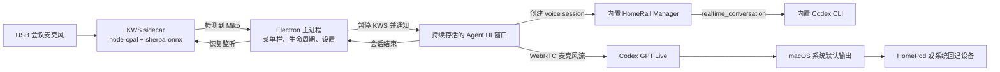

# HomeRail Miko macOS 语音助手实施计划

> 状态：实施进行中（Phase 1/2 已完成，Phase 3/4 正在联调，Phase 6 PR 构建已通过）
> 最后更新：2026-07-31
> 上游基线：`xiaotianfotos/homerail@800592b8a0cbea7c46de63c5684e7da9abdf8951`
> 目标仓库：`engty/homerail`
> 目标 App：`HomeRail Miko`

## 1. 目标与完成标准

构建一个可以长期运行在 Apple Silicon Mac mini 上的 macOS 菜单栏 App。外置 USB 会议麦克风持续在本地监听固定唤醒词 `Miko`，发音为中文“米可”。唤醒成功后，App 释放唤醒检测所占用的麦克风，自动进入 HomeRail 现有的 Codex GPT Live 实时会话。

首版必须达到以下结果：

- `HomeRail Miko.app` 可以安装并运行在 Apple Silicon、macOS 15 及以上系统。
- 首次设置完成后，App 在用户登录时自动启动并开始监听。
- 唤醒前的音频仅在本机内存中处理，不保存、不上传。
- 呼喊“米可”后不需要点击界面即可进入 GPT Live。
- 任意时刻只有一个组件占用指定的 USB 麦克风。
- 说出“结束对话”后立即结束当前会话。
- 助手说完后，默认 60 秒没有用户语音则自动结束；可在 15 到 300 秒之间调整。
- 会话正常结束、失败或超过静默时间后，自动恢复本地唤醒监听。
- GPT 音频跟随 macOS 系统默认输出；系统选择 HomePod 时使用 HomePod，断开后的回退由 macOS 负责。
- GitHub Actions 从公开 fork 构建 arm64 DMG、ZIP 和 SHA-256 校验文件。
- 在当前 M4 MacBook 完成调试，再通过 Mac mini 长时间运行验收。

## 2. 已确认决策

| 项目 | 决策 |
| --- | --- |
| GitHub 仓库 | 公开 fork 到 `engty/homerail`，保留上游 MIT License 和 attribution |
| App 身份 | 显示名 `HomeRail Miko`，bundle identifier 为 `com.engty.homerailmiko` |
| 支持平台 | 仅 Apple Silicon，最低 macOS 15 |
| 唤醒词 | 固定为 `Miko`，首版不支持任意词编辑 |
| 唤醒发音 | 中文“米可”，音素配置 `M IY1 K OW0 @MIKO` |
| 唤醒引擎 | 离线 `sherpa-onnx`，不使用需要 AccessKey 的云服务 |
| 输入设备 | 用户明确选择的外置 USB 麦克风 |
| 当前 MacBook 调试组合 | 使用 MacBook 内置麦克风作为输入；macOS 音频输出选择“客厅”（HomePod AirPlay） |
| 麦克风断开 | 暂停并通知；同一设备恢复后才自动继续，不擅自切换内置麦克风 |
| 唤醒灵敏度 | 低、中、高三档，默认中档，设置页提供实时测试 |
| 唤醒反馈 | 播放短提示音，默认开启，可关闭 |
| 对话方式 | 一次唤醒后进入连续 GPT Live 对话 |
| 结束方式 | “结束对话”、菜单命令、致命错误或助手回答后的静默超时 |
| 静默超时 | 默认 60 秒，可设置 15 到 300 秒 |
| 音频输出 | 跟随 macOS 系统默认输出，显示当前设备并提供声音设置入口 |
| 自动启动 | 首次设置完成后登录启动并自动监听 |
| Codex | App 内置兼容版本，并引导执行 `codex login --device-auth` |
| Docker | 仅 DAG/Worker 任务需要；Docker 缺失不能阻塞唤醒和 GPT Live |
| 首版分发 | 个人使用、未公证或 ad-hoc 签名版本，接受首次手动放行 Gatekeeper |
| GitHub 产物 | arm64 DMG、ZIP、SHA-256 校验文件 |

## 3. 首版边界

首版不包含：

- 使用 HomePod 麦克风或调用私有 AirPlay API。
- Intel Mac、Windows、iOS 或 Android 支持。
- 自定义任意唤醒词。
- 自动批准 HomeRail 工具调用或破坏性操作。
- 普通语音对话对 Docker 的强依赖。
- Developer ID 公证、自动更新或静默安装。
- 未经用户操作修改 Mac 睡眠、断电恢复、麦克风或输出设备设置。

HomeRail 现有的确认边界继续作为唯一事实来源。GPT Live 请求受保护操作时，App 必须显示待确认状态并打开 HomeRail 窗口，唤醒流程不能绕过任何确认。

## 4. 目标架构



### 4.1 进程划分

- **Electron 主进程**：负责菜单栏、设置窗口、登录启动、权限策略、输出设备状态、通知、子进程监管和总状态机。
- **HomeRail runtime sidecar**：使用内置 arm64 Node.js 启动 Manager 和预构建 Agent UI，只绑定 loopback。App 数据放在 `~/Library/Application Support/homerail-miko-macos/homerail/`；Codex 认证仍由 Codex 在用户正常的 Codex home 中管理。
- **KWS sidecar**：独立 Node 子进程，使用 `node-cpal` 捕获 CoreAudio，使用 `sherpa-onnx-node` 检测关键词。原生音频计算不阻塞 Electron UI，KWS 崩溃也不应拖垮主进程。
- **Agent UI renderer**：窗口隐藏后仍保持运行。它负责 WebRTC 和现有 `CodexLiveVoiceClient`，通过 context-isolated preload bridge 接收唤醒事件。
- **Codex CLI**：通过 `HOMERAIL_CODEX_BIN` 交给 Manager。允许监听前必须检查版本、认证状态和 `realtime_conversation` capability。

### 4.2 麦克风唯一所有权

状态机必须严格执行：

1. `listening`：KWS 占用 USB 麦克风。
2. `wake-detected`：KWS 立即关闭 CoreAudio stream。
3. `live-connecting`：renderer 使用 `getUserMedia` 获取同一设备。
4. `live-*`：GPT Live 独占麦克风。
5. `ending`：renderer 停止全部 `MediaStreamTrack` 并确认释放。
6. `listening`：KWS 重新打开指定设备。

任何超时、重试、renderer reload 或子进程崩溃都不能导致 KWS 和 GPT Live 同时占用麦克风。所有权不明确时必须 fail closed 到 `paused` 并提示错误。

### 4.3 唤醒词实现

- 固定依赖 `sherpa-onnx-node@1.13.4` 和 `node-cpal@0.1.1`。
- 模型使用 `sherpa-onnx-kws-zipformer-zh-en-3M-2025-12-20`，优先使用 chunk-16 的 int8 encoder/joiner，降低常驻 CPU。
- 从 sherpa-onnx 官方 GitHub Release 获取模型并校验：

  ```text
  sha256:68447f4fbc67e70eee3a93961f36e81e98f47aef73ce7e7ca00885c6cd3616a6
  ```

- 只生成一个关键词：

  ```text
  M IY1 K OW0 @MIKO
  ```

- 以设备原生采样率读取 mono float 音频，在内存中重采样到 16 kHz，不写入磁盘。
- 灵敏度初始映射为 `keywords_score=1.0`，阈值分别为低 `0.35`、中 `0.25`、高 `0.15`。只根据可重复的正负样本调整内部参数，界面始终保留三档。
- 一次唤醒后禁止继续触发，直到 KWS 被显式 rearm。

模型包在发布前必须确认可再分发。如果找不到明确的再分发许可，不把模型提交到 Git 或打入安装包；改为首次设置时经用户确认后从官方 Release 下载，验证固定 digest 后存放到 Application Support。

### 4.4 输入设备映射

CoreAudio 和 Chromium 的设备 ID 不一致。设置中保存显示名称、native device ID、Chromium device ID，以及可用时的 group ID。启动时：

1. 请求麦克风权限。
2. 同时枚举 native 和 Chromium 输入设备。
3. 优先按固定 ID 恢复，再按精确名称匹配。
4. 无法唯一识别时进入 `paused`，要求用户重新选择。

GPT Live 获取音频时请求 mono、echo cancellation、noise suppression 和 automatic gain control。日志可以记录设备名称与状态，但不能记录音频样本和认证数据。

## 5. 接口与状态

### 5.1 设置数据

使用原子替换保存经过版本验证的 JSON：

```ts
interface MikoSettingsV1 {
  schemaVersion: 1
  onboardingComplete: boolean
  startAtLogin: boolean
  listeningEnabled: boolean
  inputDevice: {
    label: string
    nativeDeviceId: string
    browserDeviceId: string
    groupId?: string
  } | null
  sensitivity: 'low' | 'medium' | 'high'
  silenceTimeoutSeconds: number
  wakeSoundEnabled: boolean
}
```

默认值为 `startAtLogin=true`、`listeningEnabled=true`、`sensitivity='medium'`、`silenceTimeoutSeconds=60`、`wakeSoundEnabled=true`。首次设置和麦克风测试成功前，不允许真正开始后台监听。

### 5.2 Preload bridge

只暴露收敛且 context-isolated 的 `window.homerailMiko` API：

- 读取状态、设置、native 输入设备、系统输出名称、麦克风权限和 Codex capability。
- 更新经过 schema 验证的设置。
- 启动/暂停唤醒监听，结束当前对话。
- 启动/取消 Codex device auth，不暴露 auth 文件内容。
- 打开声音设置、打开主窗口、管理登录启动。
- 订阅和取消订阅 typed status、wake、device、auth、error 事件。

不能向 renderer 暴露原始 Node.js、文件系统、shell 或不受限制的 IPC。

### 5.3 Sidecar 协议

主进程和 KWS 使用 stdin/stdout 上的 newline-delimited JSON：

- 主进程到 KWS：`configure`、`start`、`pause`、`shutdown`、`ping`。
- KWS 到主进程：`ready`、`listening`、`wake`、`audio-level`、`device-lost`、`device-restored`、`error`、`pong`。
- 每个命令和事件带单调递增的 generation ID，过期事件不能启动已结束的会话。
- 拒绝 malformed、oversized 或不符合当前状态的消息，日志前先对路径和诊断文本做脱敏。

### 5.4 助手状态

菜单栏和设置页只使用一套状态：

```text
setup-required
paused
listening
wake-detected
live-connecting
live-listening
user-speaking
assistant-speaking
reconnecting
ending
error
```

静默计时器只在一段 assistant speech 完成后启动，检测到用户发言后取消或重置，离开 live 状态时必须清除。用户最终 transcript 经过空白和标点标准化后，只有精确等于“结束对话”才作为本地命令消费，不能触发下一轮助手回答。

## 6. 用户体验

### 6.1 首次设置

首次设置是一个紧凑的操作清单：

1. 检查 macOS、CPU 架构和内置 runtime。
2. 请求麦克风权限。
3. 选择 USB 输入设备，查看音量表，选择灵敏度并完成本地“米可”测试。
4. 运行内置 Codex device auth，并验证 `realtime_conversation`。
5. 显示当前系统输出，并打开声音设置让用户选择 HomePod。
6. 确认提示音、静默超时和登录启动。
7. 开始监听并隐藏到菜单栏。

### 6.2 菜单栏

菜单栏显示当前助手状态、指定麦克风和当前系统输出，提供：

- 暂停/恢复监听
- 结束对话
- 打开 HomeRail
- 打开 Miko 设置
- 打开 macOS 声音设置
- 运行诊断
- 退出

关闭窗口只隐藏。退出必须关闭 KWS、GPT Live、HomeRail 子进程、计时器和菜单栏资源。

### 6.3 故障行为

- USB 麦克风移除：暂停、只通知一次；只有同一设备恢复后才自动继续。
- Codex 未登录或认证过期：暂停并打开认证步骤。
- GPT Live 连接失败：沿用现有有限重连；最终失败后释放麦克风并恢复 KWS。
- Manager 崩溃：结束当前会话，有限退避重启；Manager 恢复健康前 KWS 保持暂停。
- HomePod 或输出设备变化：更新状态，不主动中断会话；输出回退交给 macOS。
- Docker 不可用：仅标记 DAG 能力 degraded，唤醒和 GPT Live 继续工作。

## 7. 实施阶段与 To-Do List

以下清单是唯一权威进度。实施过程中直接更新复选框和文档顶部状态，不另建一套任务状态。

### Phase 0：规划和仓库准备

- [x] 检查上游 HomeRail 架构、GPT Live client、音频设备选择、Codex capability 和桌面构建流程。
- [x] 确认官方 `homerail_desktop` 是私有仓库，当前账号不能复用。
- [x] 在当前 M4 MacBook 验证 `sherpa-onnx-node` 和 `node-cpal` 可以加载。
- [x] 验证模型包含“米可”所需全部音素。
- [x] 完成产品、隐私、分发和故障策略确认。
- [x] 保存本计划到 `docs/miko-macos-voice-assistant-plan.md`。
- [x] 公开 fork `xiaotianfotos/homerail` 到 `engty/homerail`。
- [x] 设置 `origin=engty/homerail`、`upstream=xiaotianfotos/homerail`。
- [x] 创建 `codex/miko-macos-app` 分支，不直接在 fork 的 `main` 开发。
- [x] 将本计划作为第一个独立 commit 推送。

### Phase 1：macOS 壳与 runtime

- [x] 新增独立的 `homerail_macos` Electron package，不修改或依赖官方私有 desktop 仓库。
- [x] 在 lockfile 和 runtime manifest 中固定 Electron `43.2.0`、electron-builder `26.15.3`、Node `24.18.0` 和全部 native dependencies。
- [x] 实现 single instance、context isolation、sandboxed renderer、收敛的 permission handler、菜单栏生命周期、隐藏窗口和干净退出。
- [ ] 使用现有 HomeRail 视觉资产生成合规的 App icon 和 macOS menu bar template icon。
- [x] 内置 arm64 Node 和构建后的 HomeRail packages；Manager 与静态 Agent UI 只绑定动态选择的 loopback 端口。
- [x] 使用 App 专用 `HOMERAIL_HOME`、health probe 和有限重启退避，禁止凭据日志。
- [x] 增加按大小和数量轮转的诊断日志，并在写入前做凭据形态脱敏。
- [x] 内置 `@openai/codex@0.146.0`，设置 `HOMERAIL_CODEX_BIN`，实现 device auth 引导和 capability 检查（真实登录仍需在安装后的用户环境中执行）。
- [x] 验证 Docker Desktop 未启动时 Manager 和静态 Agent UI 仍可启动；本机 runtime 使用 `--no-build-worker-image` 健康检查通过，GPT Live 真实会话仍待 Codex 登录后验证。

### Phase 2：唤醒词服务

- [x] 新增 KWS sidecar、typed NDJSON 协议、generation guard、进程监管和单元测试。
- [x] 实现模型下载、固定 URL/digest 校验和 license/redistribution gate。
- [x] 实现 16 kHz streaming、resampling、“米可”配置、三档灵敏度、唤醒限流和纯本地音频处理。
- [x] 实现 native 输入枚举、指定设备持久化、断开检测、通知和同设备恢复（物理拔插验收待在真实 USB 麦克风上执行）。
- [x] 实现不会启动 GPT Live 的本地 KWS 测试模式（提示音、KWS 音量表和“米可”检测反馈已完成）。

### Phase 3：GPT Live 集成

- [ ] 将 voice cockpit 中的现有集成整理为可复用 desktop voice-session controller，继续使用 `CodexLiveVoiceClient`。
- [x] 新增 typed preload bridge 和 desktop-only UI event handling。
- [x] 唤醒进入 GPT Live 前等待 KWS pause acknowledgement，避免两路同时申请麦克风。
- [ ] 补充 renderer 崩溃或所有权不明确时的 live-input lease，并 fail closed 到暂停状态。
- [x] 唤醒时自动创建新的 HomeRail voice session，并用指定 USB 输入启动 GPT Live。
- [x] 实现“结束对话”、可配置静默超时、菜单结束、重连和自动恢复 KWS。
- [ ] 保留全部工具确认和 destructive-action 保护。
- [x] 监测 macOS 系统输出并显示 AirPlay/HomePod 或系统回退状态，不实现私有输出路由。

### Phase 4：首次设置、设置页和诊断

- [x] 增加权限、麦克风选择、本地 KWS 测试、Codex 登录、超时、提示音开关、系统输出状态和登录启动的首次设置。
- [ ] 将 Miko 设置集成进现有 HomeRail 设置体验，不向用户暴露原始 KWS 参数。
- [ ] 增加菜单栏状态和命令、可操作通知和脱敏诊断导出。
- [x] 增加设置 schema validation、原子持久化和前向迁移测试。
- [ ] 明确展示隐私边界：唤醒前音频只在本地，唤醒后的语音发送到 GPT Live。

### Phase 5：当前 M4 MacBook 验证

- [x] 运行根目录 typecheck、build，以及 macOS shell 和 Agent UI focused tests。
- [ ] 补跑完整现有 HomeRail CI tests。
- [x] 验证打包 App 启动、Manager/UI health、内置 Codex/KWS runtime、sidecar 设备枚举和干净退出。
- [ ] 补充 Electron preload isolation、permission、settings 和完整 sidecar lifecycle 验证。
- [ ] 使用 mock 完成 wake、connect、conversation、timeout、voice command、disconnect、reconnect 和 fatal recovery 的端到端状态测试。
- [ ] 使用“米可”正样本及普通对话/电视负样本测试三档灵敏度。
- [x] 本地构建 arm64 App，检查 bundle、nested native binaries、Codex/KWS runtime、麦克风说明和 unsigned package smoke（DMG `d63b84698ce23cf948393ed9c9a23d4ffc31e6703c5e9b586cd1408d02f7b434`，ZIP `4d56b7a5e4529a40645aab2316e6605682889ce3a9edd134dfd3392c8b219485`）。
- [ ] 整包安装，完成真实 Codex device auth 和 GPT Live 对话。
- [ ] 在当前 MacBook 先用内置麦克风唤醒，并将 GPT Live 音频输出到“客厅”HomePod，完成真实链路验收。
- [ ] 验证 HomePod 输出、系统回退、麦克风交接、登录启动、关闭隐藏、退出重启和无 Docker 运行。

### Phase 6：GitHub 构建和发布

- [x] 新增 fork 自有的 macOS workflow，不包含 actor 限制、私有仓库 token 或 `homerail_desktop` 依赖。
- [x] Pull request 上执行确定性测试和 unsigned arm64 package smoke test，runner 使用 `macos-15`（run `30636975142` 通过）。
- [ ] 手动 dispatch 和 `miko-v*` tag 构建 DMG/ZIP，验证内置 Node/Codex/KWS 和架构，并生成 SHA-256。
- [x] 第三方 Actions 固定到 commit SHA；除 tag release job 外使用只读权限。
- [x] 上传 CI artifacts（push run `30636970595` 已生成 DMG、ZIP 和 SHA-256）。
- [ ] 创建 `miko-v0.1.0` GitHub prerelease，写明安装、Gatekeeper、隐私和限制。
- [ ] 从 `codex/miko-macos-app` 向 `engty/homerail` 创建 PR，检查精确 diff，全部 checks 通过后合并。

### Phase 7：Mac mini 部署和验收

- [ ] 下载 GitHub 构建的 DMG 并验证 SHA-256。
- [ ] 安装到 `/Applications`，首次手动放行 Gatekeeper，完成麦克风和 Codex onboarding。
- [ ] 将 HomePod 选为 macOS 系统输出，将 USB 会议麦克风选为 Miko 输入。
- [ ] 启用 Login Item，验证 logout/login 和完整重启后的自动恢复。
- [ ] 执行下方客厅校准和验收测试。
- [ ] 完成 8 小时监听 soak test 和多轮 GPT Live soak test，检查脱敏日志、CPU、内存、误唤醒和恢复。
- [ ] 为测试通过的 commit 打 tag，在 release notes 记录 App 版本、commit、模型 digest、Codex 版本、macOS 和麦克风型号。

### 需要用户提供或执行的事项

- [ ] 准备一只兼容 macOS 的 USB 全向会议麦克风。开发可先用 MacBook 麦克风，最终校准必须使用真实设备。
- [x] 当前 MacBook 调试设备已确认：MacBook 内置麦克风作为输入，系统输出“客厅”作为 HomePod AirPlay 输出；Mac mini 最终替换为 USB 全向会议麦克风。
- [ ] 麦克风放在正常说话清晰、但不紧贴或正对 HomePod 的位置。
- [ ] 确认 OpenAI/Codex 账号可以使用 GPT Live，并亲自完成一次 device auth；不共享 auth 文件或 token。
- [ ] 确认 Mac mini 为 Apple Silicon、macOS 15+，并有足够空间存放 App、runtime、模型和日志。
- [ ] 根据长期运行需要手动配置 Mac mini 保持唤醒，并可选配置断电后自动开机；App 不擅自修改电源策略。
- [ ] 需要 HomePod 输出时，在 macOS 控制中心或声音设置中选择 HomePod。
- [ ] 批准麦克风权限、Login Item 和首个未公证版本的 Gatekeeper 例外。
- [ ] 在最终校准时录制代表性的“米可”呼喊，并明确客厅日常背景声和电视音量场景。

## 8. 测试矩阵与验收阈值

| 场景 | 预期结果 |
| --- | --- |
| 正常客厅距离呼喊“米可”20 次 | 当前灵敏度至少识别 18 次 |
| 普通对话和电视/音乐负样本 | 不出现系统性词语冲突；目标为 8 小时少于 1 次误唤醒 |
| 唤醒延迟 | 唤醒词结束后 1.5 秒内开始提示音 |
| 麦克风交接 | KWS stream 先关闭，WebRTC 后获取，不出现设备占用错误 |
| 说“结束对话” | 2 秒内结束并恢复 KWS |
| 60 秒超时 | 助手结束后无用户语音，60 秒正负 2 秒内结束 |
| 超时前用户说话 | 计时器取消或重置，对话继续 |
| USB 麦克风拔出再插入 | 暂停并通知，只有同一设备恢复监听 |
| HomePod 断开 | macOS 回退继续，App 更新状态且不崩溃 |
| 网络中断 | 执行有限重连；最终失败后释放麦克风并恢复 KWS |
| Codex auth 过期 | 暂停并打开认证；日志不出现凭据内容 |
| Docker 停止 | 唤醒和 GPT Live 正常，仅 DAG/Worker 显示 degraded |
| 关闭窗口/登录启动 | 窗口隐藏，后台监听继续；登录后隐藏启动 |
| 退出 App | 音频流、子进程、计时器和菜单栏资源全部结束 |
| KWS 空闲资源 | 目标低于单核 10% CPU，App/runtime 总内存低于 500 MB |

## 9. 安全、隐私与可靠性门槛

- Renderer 必须设置 `nodeIntegration=false`、`contextIsolation=true`、sandbox enabled，并只使用 allowlisted preload bridge。
- Manager/UI 只绑定 loopback；外部导航、新窗口、权限和不可信 URL scheme 默认拒绝。
- 麦克风权限只授予内置 HomeRail UI origin。
- 唤醒前音频只保留在内存，不写磁盘，不发送到 HomeRail、Codex、OpenAI、analytics 或日志。
- 唤醒后界面和菜单栏明确显示 GPT Live 正在占用麦克风，语音将发送到服务端。
- auth 文件、token、device code、API key、可能含 secret 的原始 prompt 和完整敏感路径不能写入设置、日志、诊断、release 或 Git。
- 模型、Node、Codex、Actions 和 npm artifacts 固定版本；上游提供 digest 时必须校验。
- Release packaging 检查所有 nested Mach-O 为 arm64，并检查异常的绝对 dylib 路径。
- 工具确认必须显式进行，后台语音不能批准受保护 mutation。
- 日志按大小和数量轮转、写入前脱敏，只能由用户主动导出。

## 10. 风险与回退

| 风险 | 处理方式 |
| --- | --- |
| HomePod 延迟或客厅回声影响识别 | GPT Live 期间不运行 KWS；启用 Chromium echo processing；校准麦克风位置和灵敏度 |
| USB 与 Chromium 设备 ID 不同或变化 | 保存两类 ID 和名称/group；保守匹配，存在歧义时暂停 |
| Node 原生模块在升级后失效 | 固定 Node/Electron/addon；KWS 独立进程；发布前执行打包后的 native smoke test |
| Codex Live capability 或协议变化 | 固定 Codex 版本；探测 `realtime_conversation`；保留 client tests；不支持时 fail closed |
| 上游 HomeRail 持续变化 | 保留 `upstream`；壳集中在 `homerail_macos`；减少对共享 voice code 的修改 |
| 未公证 App 被 Gatekeeper 阻止 | 文档化首次手动放行；后续增加 Developer ID 和 notarization，不迁移用户数据 |
| 模型再分发许可不明确 | 发布前审核；无法确认时从官方源首次下载并校验，不打入仓库或安装包 |
| Mac 休眠或断电 | 用户管理 macOS 电源策略；App 登录后恢复最后一个安全状态，不宣称睡眠期间仍在监听 |

回退必须无损：

1. 从菜单栏暂停监听或退出。
2. 关闭 Login Item。
3. 用上一版 GitHub artifact 整包替换 App，或从 `/Applications` 删除。
4. 默认保留 Application Support 数据和日志；删除只能通过独立且明确的 reset 操作。
5. fork 回到最近通过测试的 `miko-v*` tag，不 force push，不改写上游历史。

## 11. 完成记录

实施完成后在这里补充：

- Fork URL 和 merged PR
- 最终 commit 和 release tag
- GitHub Actions run URL
- DMG/ZIP 文件名与 SHA-256
- M4 MacBook 验证结果
- Mac mini 硬件、macOS 和麦克风信息
- Soak test 结果及剩余已知限制
